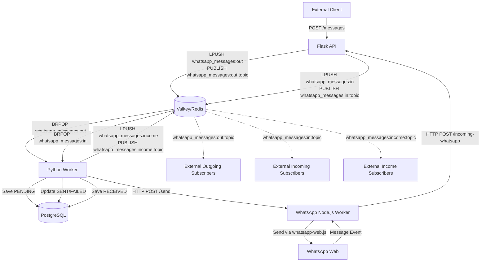

# 🚀 Redis Queue to WhatsApp

A high-performance, asynchronous bridge between Redis (Valkey) and WhatsApp Web, built with Python and Node.js. This project allows you to send and receive WhatsApp messages through a robust queuing system.

---

## 🏗️ Architecture

The system is designed with a microservices approach to ensure scalability and reliability. Each Redis flow uses a queue for worker consumption and a matching Pub/Sub topic for external subscribers.



### Key Components:
- **Flask API**: The entry point for sending messages and receiving notifications from the WhatsApp worker.
- **Valkey (Redis)**: Orchestrates the asynchronous message flow using reliable queues and Pub/Sub topics.
- **Python Worker**: Handles the business logic, database persistence, and communicates with the WhatsApp controller.
- **Node.js WhatsApp Worker**: Leverages `whatsapp-web.js` to manage the actual WhatsApp Web session and media handling.
- **PostgreSQL**: Stores the outcome of every message and a history of incoming communications.

---

## 🛠️ Features

- **Asynchronous Processing**: Non-blocking message sending using Redis queues.
- **Queue + Topic Integration**: Each enqueue operation can also publish to a related Redis topic so other services can subscribe to incoming/outgoing events.
- **Reliable Persistence**: Every message state is tracked in PostgreSQL.
- **Media Support**: Support for images, videos, audio, and documents.
- **Observability**: Fully instrumented with OpenTelemetry for tracing and logging.
- **High Performance**: Built on top of Valkey for lightning-fast queue operations.

---

## 🚀 Getting Started

### Prerequisites

- Docker and Docker Compose
- WhatsApp account for scanning the QR code

### Installation

1.  **Clone the repository:**
    ```bash
    git clone https://github.com/your-repo/redis-queue-to-whatsapp.git
    cd redis-queue-to-whatsapp
    ```

2.  **Configure environment variables:**
    Copy the `.env.example` (or use the existing `.env`) and adjust settings:
    ```bash
    cp .env.example .env
    ```

3.  **Spin up the infrastructure:**
    ```bash
    docker-compose up -d --build
    ```

4.  **Connect to WhatsApp:**
    Check the logs of the `whatsapp_node` container to scan the QR code:
    ```bash
    docker logs -f whatsapp-node
    ```

---

## 🔌 API Documentation

### Outgoing Messages
`POST /messages`

**Payload:**
```json
{
  "cellphone": "5511999999999",
  "message": "Hello from the Redis Queue!",
  "type": "text"
}
```

### Incoming Messages
The system automatically enqueues incoming messages to the `whatsapp_messages:income` Redis queue after persisting them to the database and publishes the same payload to `whatsapp_messages:income:topic`.

### Redis Queues and Topics
- `whatsapp_messages:out` queue + `whatsapp_messages:out:topic`
- `whatsapp_messages:in` queue + `whatsapp_messages:in:topic`
- `whatsapp_messages:income` queue + `whatsapp_messages:income:topic`

Queues are consumed by workers, while topics are available to independent Redis Pub/Sub subscribers without removing messages from the queues.

---

## 📊 Monitoring

- **Redis Insight**: Accessible at `http://localhost:8002`
- **Tracing**: OpenTelemetry exporters are configured to send data to your OTLP endpoint (e.g., SigNoz or Jaeger).

---

## 📄 License

This project is licensed under the MIT License - see the [LICENSE](LICENSE) file for details.

made with ❤️ by @giomartinsdev
